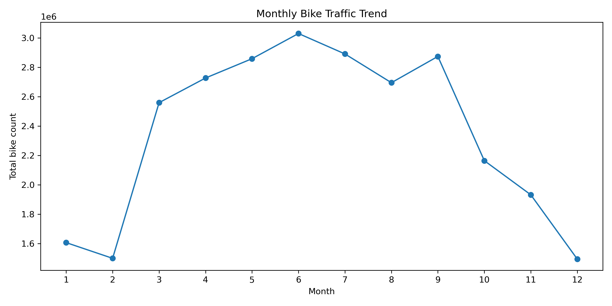
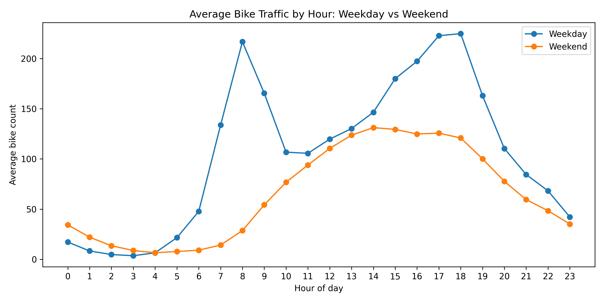
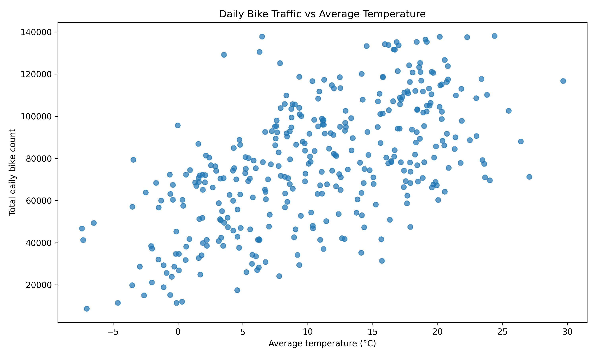
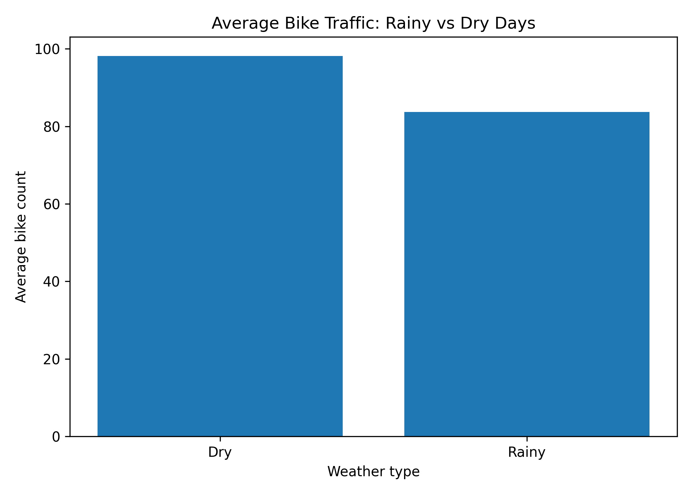

# Berlin Analytics Warehouse

A local DuckDB analytics warehouse that combines Berlin bike counter data with historical Berlin weather data for 2025.

This project is part of the **Berlin Data Engineering Lab** portfolio. It connects two upstream pipeline projects and turns their outputs into an analytics-ready warehouse, reproducible report figures, SQL analysis, and an exploratory insights notebook.

The purpose of this project is not only to build tables, but to answer analytical questions about how bike traffic in Berlin changes over time and how it relates to weather conditions.

---

## Project Highlights

- Built a local DuckDB warehouse from two separate data pipeline outputs.
- Modeled bike traffic, dates, stations, and weather data using a star-schema-inspired structure.
- Connected mobility and weather data through a shared `date_id` key.
- Generated reproducible report figures with Python.
- Created an exploratory Jupyter notebook to explain patterns, assumptions, and limitations.
- Added local tests, Ruff linting, and GitHub Actions for code quality.

---

## Connected Portfolio Workflow

This project is the third step in a connected portfolio workflow:

```text
Berlin Mobility Pipeline
        │
        │ bike_counts_2025_clean.parquet
        ▼
Berlin Analytics Warehouse
        ▲
        │ weather_2025_historical.parquet
        │
Berlin Weather Pipeline
```

The first two projects prepare clean Parquet outputs. This project combines those outputs into a local analytical warehouse.

---

## Analytical Questions

The warehouse and notebook are designed to answer questions such as:

- How does bike traffic change by month, weekday, and hour?
- Which bike counting stations record the highest traffic?
- Are weekday commuting patterns different from weekend cycling behavior?
- How does average daily temperature relate to bike traffic?
- Are rainy days associated with lower cycling activity?
- Can surprising weather results be validated with daily-level checks?

---

## Key Insights

The exploratory analysis shows several patterns in Berlin bike traffic and weather data.

### 1. Bike traffic is seasonal

Bike traffic is highest in warmer months and lowest in winter. The highest monthly traffic appears in **June**, with about **3.03 million bike counts**, while the lowest appears in **December**, with about **1.50 million bike counts**.

### 2. Weekday traffic shows commuting patterns

Hourly traffic shows clear weekday peaks around **08:00** and **17:00–18:00**. Weekend traffic is flatter and increases more gradually during the day.

This supports the interpretation that a significant part of weekday cycling is related to commuting, school, university, or other regular routines.

### 3. Some stations dominate total traffic

The busiest station, **05-FK-OBB-O**, records about **2.09 million bike counts**. This suggests that some counting locations represent especially important cycling corridors.

### 4. Temperature is positively related to bike traffic

Average daily temperature and total daily bike traffic show a moderate positive relationship, with a correlation of about **0.598**.

Warmer days are generally associated with higher bike traffic, but this should not be interpreted as proof that temperature alone causes the increase.

### 5. Rainy days show lower average bike traffic

Dry days show about **98 average bike counts**, while rainy days show about **84 average bike counts**.

This suggests that precipitation may be associated with reduced cycling activity, although temperature, seasonality, holidays, and weekday/weekend effects may also influence the result.

### 6. Data validation is part of the analysis

July has the highest monthly precipitation in the dataset. A daily check shows that this is mainly driven by a few strong rain events, not constant rain throughout the month.

This step is important because it shows that the analysis does not only generate charts, but also checks whether surprising results are plausible.

These insights are exploratory and should not be interpreted as proof of causality.

---

## Selected Visual Outputs

### Monthly bike traffic



Bike traffic follows a clear seasonal pattern. The highest monthly traffic appears in **June** with about **3.03 million bike counts**, while the lowest appears in **December** with about **1.50 million bike counts**.

### Weekday vs weekend hourly traffic



Weekday traffic shows strong peaks around **08:00** and **17:00–18:00**, while weekend traffic is flatter and rises more gradually during the day. This supports the interpretation of commuting-related weekday cycling.

### Bike traffic vs temperature



The scatter plot shows a moderate positive relationship between temperature and bike traffic, with a correlation of about **0.598**. Warmer days are generally associated with higher bike traffic, but this does not prove causality.

### Rainy vs dry days



Dry days show higher average bike traffic than rainy days, with about **98** average bike counts on dry days compared with about **84** on rainy days.

---

## Data Sources

This project depends on local outputs from two connected portfolio projects.

### 1. Berlin Mobility Pipeline

Expected input:

```text
../berlin-mobility-pipeline/data/processed/bike_counts_2025_clean.parquet
```

This file contains cleaned Berlin bike counter data for 2025.

### 2. Berlin Weather Pipeline

Expected input:

```text
../berlin-weather-pipeline/data/processed/weather_2025_historical.parquet
```

This file contains historical hourly Berlin weather data for 2025.

---

## Warehouse Output

The warehouse is generated locally as a DuckDB database:

```text
data/processed/warehouse.duckdb
```

This file is generated by the project and is ignored by Git.

---

## Warehouse Model

The warehouse uses a simple star-schema-inspired model.

```text
fact_bike_counts
├── date_id
├── station_name
├── bike_count
└── hour

dim_date
├── date_id
├── year
├── month
├── day
├── weekday
└── is_weekend

dim_weather
├── weather_id
├── date_id
├── avg_temp_c
├── total_precipitation_mm
└── avg_wind_speed

dim_station
├── station_pk
└── station_name
```

The central fact table is `fact_bike_counts`. It can be joined with `dim_date` and `dim_weather` through `date_id`.

---

## Repository Structure

```text
berlin-analytics-warehouse/
├── README.md
├── requirements.txt
├── src/
│   ├── ingest.py
│   └── create_reports.py
├── sql/
│   ├── schema.sql
│   └── analysis.sql
├── tests/
│   └── test_warehouse.py
├── notebooks/
│   └── warehouse_insights.ipynb
├── Reports/
│   └── figures/
│       ├── daily_bike_traffic_vs_temperature.png
│       ├── bike_traffic_by_temperature_range.png
│       ├── hourly_pattern.png
│       ├── hourly_weekday_vs_weekend.png
│       ├── monthly_trend.png
│       ├── monthly_temperature.png
│       ├── monthly_precipitation.png
│       ├── rain_vs_dry.png
│       ├── top_stations.png
│       └── weekday_vs_weekend.png
└── .github/
    └── workflows/
        └── ci.yml
```

---

## Setup

Install the dependencies:

```bash
pip install -r requirements.txt
```

Main libraries:

```text
duckdb
pandas
matplotlib
pytest
ruff
jupyter
pyarrow
```

---

## Build the Warehouse

Before running this project, make sure the two upstream projects have already generated their processed Parquet files.

Then run:

```bash
python3 src/ingest.py
```

Expected result:

```text
data/processed/warehouse.duckdb
```

Example output:

```text
Mobility loaded: 306600 rows
Weather loaded: 8760 rows
Warehouse built successfully
```

---

## Generate Analysis Figures

After building the warehouse, generate report figures with:

```bash
python3 src/create_reports.py
```

The figures are saved under:

```text
Reports/figures/
```

Generated figures include:

- `top_stations.png`
- `monthly_trend.png`
- `hourly_pattern.png`
- `hourly_weekday_vs_weekend.png`
- `rain_vs_dry.png`
- `daily_bike_traffic_vs_temperature.png`

The exploratory notebook also generates additional figures:

- `monthly_temperature.png`
- `monthly_precipitation.png`
- `weekday_vs_weekend.png`
- `bike_traffic_by_temperature_range.png`

---

## Exploratory Insights Notebook

A detailed exploratory analysis notebook is available at:

```text
notebooks/warehouse_insights.ipynb
```

The notebook explores:

- monthly bike traffic patterns
- hourly bike traffic patterns
- top bike counting stations
- weekday vs weekend cycling behavior
- monthly temperature and precipitation
- daily bike traffic vs average temperature
- rainy vs dry day comparison
- bike traffic by temperature range
- data quality checks, such as investigating the high July precipitation value

The notebook shows how the three connected projects move from raw data pipelines to analytical insights.

---

## SQL Analysis

Example SQL queries are stored in:

```text
sql/analysis.sql
```

The SQL analysis includes:

- total bike counts per day
- top 10 busiest stations
- weekday vs weekend traffic
- busiest hours of the day
- rainy vs dry day comparison
- monthly bike traffic trend

Example join between mobility and weather data:

```sql
SELECT
    f.date_id,
    SUM(f.bike_count) AS total_bike_count,
    w.avg_temp_c,
    w.total_precipitation_mm,
    w.avg_wind_speed
FROM fact_bike_counts AS f
JOIN dim_weather AS w
    ON f.date_id = w.date_id
GROUP BY
    f.date_id,
    w.avg_temp_c,
    w.total_precipitation_mm,
    w.avg_wind_speed
ORDER BY f.date_id;
```

---

## Quality Checks

Run tests locally with:

```bash
pytest tests/ -v
```

Run Ruff linting with:

```bash
ruff check .
```

Recommended full local check:

```bash
python3 src/ingest.py
python3 src/create_reports.py
pytest tests/ -v
ruff check .
git status
```

---

## Continuous Integration

GitHub Actions runs Ruff linting on each push and pull request to the `main` branch.

Current CI check:

```text
ruff check .
```

The warehouse tests are currently run locally because they depend on the generated local DuckDB database.

---

## Current Limitations

- The analysis is exploratory and does not prove causality.
- Bike traffic may be influenced by holidays, public events, construction, station location, daylight, tourism, and commuting behavior.
- Weather is aggregated daily in the warehouse, while bike counts are available hourly.
- The station dimension currently uses station IDs but does not include geographic metadata such as district, coordinates, or street names.
- The warehouse currently depends on locally generated outputs from the first two projects.
- CI currently does not rebuild the warehouse or run warehouse tests automatically.

---

## Next Steps

Planned improvements:

- Add holiday and public event context.
- Enrich station data with geographic metadata.
- Compare station-level behavior across different weather conditions.
- Add small fixture datasets so warehouse tests can run in GitHub Actions.
- Build a FastAPI layer to query the warehouse data.
- Connect the project outputs to a portfolio website.

---

## Portfolio Context

This project demonstrates a complete local analytics workflow:

```text
Berlin Mobility Pipeline
→ Berlin Weather Pipeline
→ Berlin Analytics Warehouse
→ Report figures
→ Exploratory insights notebook
```

It shows skills in:

- data engineering
- SQL analytics
- data modeling
- DuckDB
- Python automation
- reproducible report generation
- exploratory data analysis
- testing and CI
